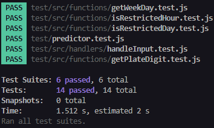

# pico-placa-predictor
[Sebastian Cruz](github.com/SbsCruz)
 
This app allows users to check if they are able to be on the road or not, according to the rules of _Pico & Placa_ in Quito, Ecuador.

It was developed with `JS + Node + Jest`

## Installation

_Note:_ You'll need __Node__ and __npm__ in order to install the project.

1. __Clone this Repository__

``` bash
git clone https://github.com/SbsCruz/pico-placa-predictor
cd pico-placa-predictor
```

2. __Install dependecies__

``` bash
npm i
```

3. __Run the app__

``` bash
node index.js
```

## How to

Once you run the application, it will ask you about your plate number, date and hour, be sure to follow the formats

``` bash
Por favor, ingrese el número de placa (ej. ABC-1234): ABC-1239
Ingrese la fecha (formato DD/MM/AAA): 20/09/2024
Ingrese la hora (formato HH:MM, 24 horas): 07:40
No puede conducir a esta hora. Lo sentimos.
```

And now you know if you are able to be on the road or not.

## Testing

Tests are included in this project, they were developed with Jest, in order to run the tests, you need the following command

``` bash
npm run test
```

then, to run all the tests, you just have to press _a_, and you will see this:


